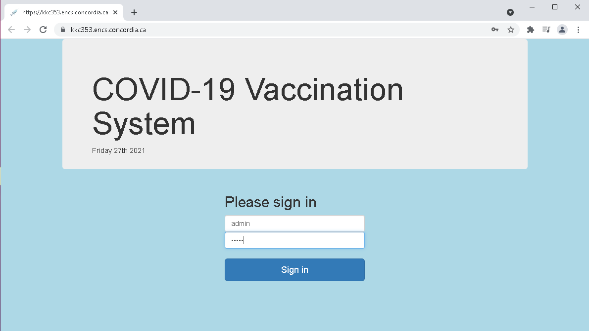
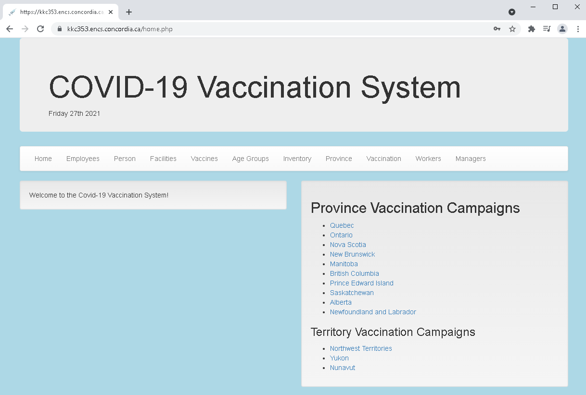
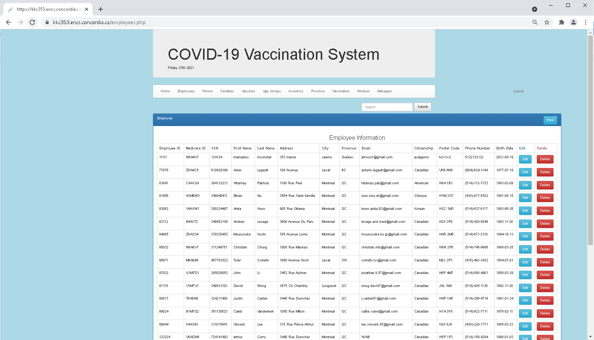
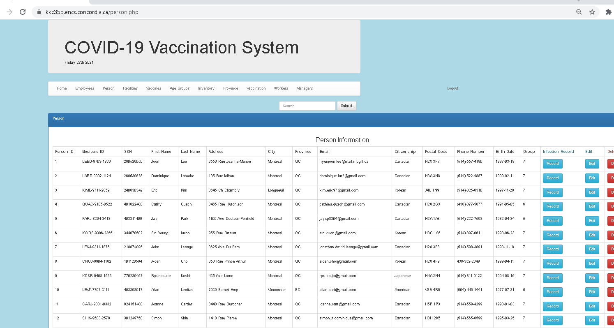
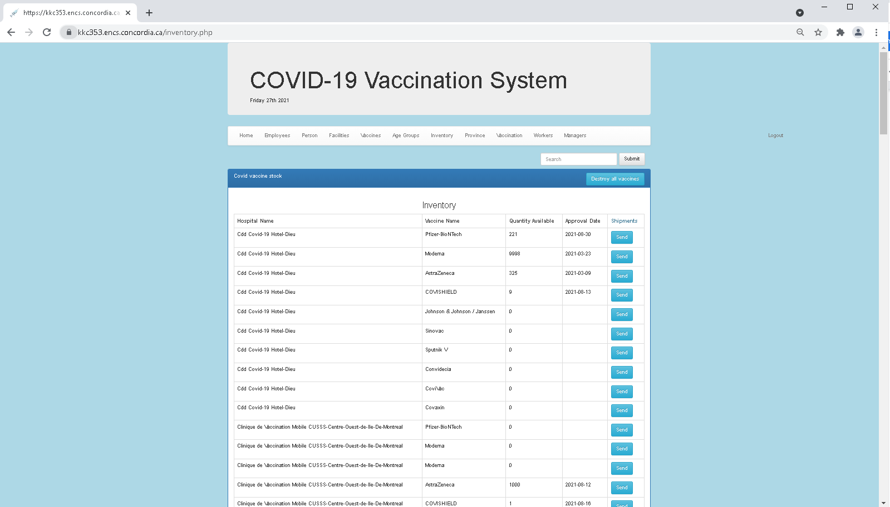

# Covid-Vaccination-System

SQL database project

# Description

This application is made to help the Canada's Health Care System keep track of the population's vaccination status against COVID-19. The system is called COVID-19 Vaccination System (C19VS).
All data will be stored inside Concordia's mysql database.

# Team members

> Joon Lee
> Kyle Taylor-Bracken
> Shariff Mohammed
> Yida Li

# Supervised by

> Dr. Khaled Jababo

# Prorgramming Lanauge :

> Database : MYSQL

> Front End : HTML/CSS

> Front End : PHP

# Screenshots :

> > > > > 

> > > > > 

> > > > > 

> > > > > 

> > > > > 